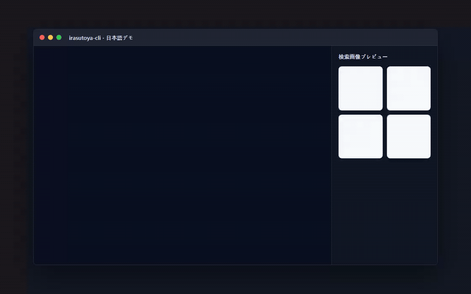

# irasutoya-cli

言語: [English](./README.md) | **日本語** | [中文](./README.zh.md) | [한국어](./README.ko.md)



[](https://libraries.io/github/Mineru98/irasutoya-cli)


## Claude Code / Codex のインストール

このリポジトリは Claude Code の**プラグインマーケットプレイス**であり、スタンドアロンの Claude / Codex スキルも同梱しています。いずれも実際の `irasutoya` CLI 検索ラッパーを実行します。プロジェクトスキルは `.claude/skills/<スキル名>/SKILL.md` に、プラグインスキルは `<プラグイン>/skills/<スキル名>/SKILL.md` に配置され、Claude Code のスキル・プラグインのドキュメントに従います。ワークフローに合った方法を選んでください。

### Claude プラグイン — マーケットプレイス（推奨）

Claude Code プラグインをインストールする標準的な方法です。リポジトリをマーケットプレイスとして追加し、そこからプラグインをインストールします。

```text
/plugin marketplace add Mineru98/irasutoya-cli
/plugin install irasutoya-search@irasutoya-cli
```

シェルから非対話的に実行することもできます。

```sh
claude plugin marketplace add Mineru98/irasutoya-cli
claude plugin install irasutoya-search@irasutoya-cli
```

インストール後、名前空間付きのスキルを呼び出します。

```text
/irasutoya-search:irasutoya-search cat
```

### Claude プラグイン — ローカルディレクトリ（開発用）

マーケットプレイスを使わずに、ローカルのチェックアウトから直接プラグインを読み込みます。

```sh
claude --plugin-dir .claude/plugins/irasutoya-search
```

呼び出し方は同じです（`/irasutoya-search:irasutoya-search cat`）。実行中のセッションでプラグインファイルを編集した場合は、`/reload-plugins` を実行するか Claude Code を再起動してください。

### Claude プロジェクトスキル（プラグインなし）

リポジトリのルートから Claude Code を起動すると、`.claude/skills/irasutoya-search` が自動的に認識されます。

```sh
claude
```

名前空間なしのスキルを呼び出します。

```text
/irasutoya-search cat
```

### Codex スキル

リポジトリに含まれるプロジェクトローカルの Codex スキルを使用します。

```sh
python .codex/skills/irasutoya-search/scripts/irasutoya_search.py cat
```

Codex では `$irasutoya-search` で呼び出すか、自然言語で Irasutoya のイラスト検索を依頼してください。

### プラグインの読み込みを検証する

公開前や変更後に、マニフェストを検証し登録済みのスキルを確認します。

```sh
# マーケットプレイスとプラグインのマニフェストを検証（CI では --strict を使用）
claude plugin validate .claude-plugin/marketplace.json --strict
claude plugin validate .claude/plugins/irasutoya-search --strict

# インストール後、スキルが登録されているか確認
claude plugin list
claude plugin details irasutoya-search
```

`claude plugin details irasutoya-search` の出力に `Skills (1) irasutoya-search` が表示されるはずです。

## セットアップ

ネイティブ Go CLI は、Windows、macOS、Linux 向けのクロスプラットフォーム配布ターゲットです。

```sh
$ git clone https://github.com/Mineru98/irasutoya-cli.git
$ cd irasutoya-cli
$ go build ./cmd/irasutoya
```

CI とリリースの基準は Go 1.26.4 です。現在の `go.mod` は、ローカルの移行環境で使っている Go 1.24.3 ツールチェーンとも互換性を保っています。

## 使い方

```sh
$ irasutoya help
Commands:
  irasutoya random          # ランダムないらすとや画像を表示します
  irasutoya search {query}  # 指定した検索語で画像を 3 件表示します
```

ONE PIECE キャラクターのデモ用に、`luffy`、`zoro`、`ルフィ`、`ゾロ`、`路飞`、`索隆`、`루피`、`조로` などのローカライズされた検索語を受け付けます。

デフォルトでは、Go CLI はページ情報と画像 URL を表示するだけで、外部アプリは開きません。OS の既定アプリで画像 URL を開く場合は明示的に有効化してください。

```sh
$ irasutoya --open-images random
$ IRASUTOYA_OPEN_IMAGES=1 irasutoya search ルフィ
```

## 開発

```sh
$ go test ./...
$ go build ./cmd/irasutoya
```

リリースビルドでは、Windows、macOS、Linux 向けアーカイブを `CGO_ENABLED=0` の GoReleaser で作成します。

```sh
$ goreleaser check
$ goreleaser release --snapshot --clean
```

## コントリビューション

このフォークへのバグ報告や変更は GitHub の https://github.com/Mineru98/irasutoya-cli で受け付けています。このプロジェクトは安全で歓迎される共同作業の場を目指しており、コントリビューターは [Contributor Covenant](http://contributor-covenant.org) の行動規範に従う必要があります。

## ライセンス

このプロジェクトは [MIT License](https://opensource.org/licenses/MIT) の条件でオープンソースとして利用できます。

## 行動規範

irasutoya-cli のコードベース、Issue、チャット、メーリングリストに関わるすべての人は、[行動規範](https://github.com/Mineru98/irasutoya-cli/blob/master/CODE_OF_CONDUCT.md) に従う必要があります。

## 作者

フォークのメンテナー: [@Mineru98](https://github.com/Mineru98)

オリジナルプロジェクト: [@unhappychoice](https://unhappychoice.com)
