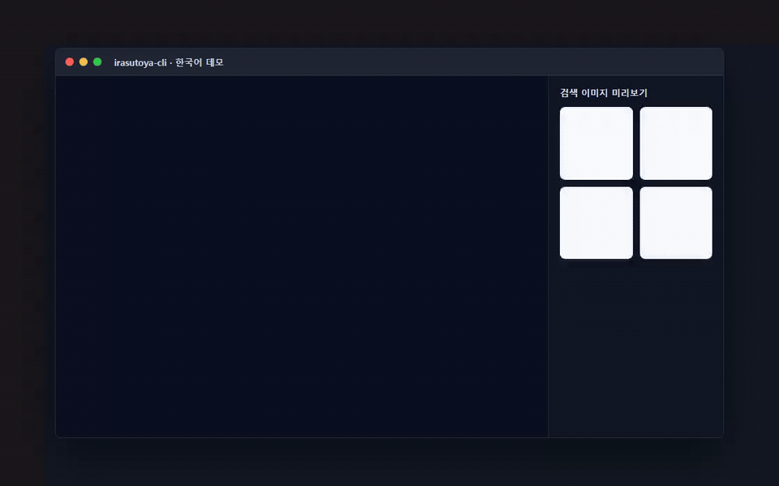

# irasutoya-cli

언어: [English](./README.md) | [日本語](./README.ja.md) | [中文](./README.zh.md) | **한국어**



[](https://libraries.io/github/Mineru98/irasutoya-cli)


## 설치

네이티브 Go CLI는 Windows, macOS, Linux를 위한 크로스 플랫폼 배포 대상입니다.

```sh
$ git clone https://github.com/Mineru98/irasutoya-cli.git
$ cd irasutoya-cli
$ go build ./cmd/irasutoya
```

CI와 릴리스 기준은 Go 1.26.4입니다. 현재 `go.mod`는 로컬 마이그레이션 환경의 Go 1.24.3 툴체인과도 호환되며, 로컬 툴체인이 업그레이드될 때까지 이 호환성을 유지합니다.

## 사용법

```sh
$ irasutoya help
Commands:
  irasutoya random          # 무작위 irasutoya 이미지를 표시합니다
  irasutoya search {query}  # 검색어로 이미지 3개를 표시합니다
```

CLI는 ONE PIECE 캐릭터 데모에 쓰이는 다국어 검색어를 지원합니다. 예를 들어 `luffy`, `zoro`, `ルフィ`, `ゾロ`, `路飞`, `索隆`, `루피`, `조로`를 사용할 수 있습니다.

기본적으로 Go CLI는 페이지 메타데이터와 이미지 URL만 출력하며 외부 앱을 열지 않습니다. OS 기본 앱으로 이미지 URL을 열려면 명시적으로 활성화하세요.

```sh
$ irasutoya --open-images random
$ IRASUTOYA_OPEN_IMAGES=1 irasutoya search 루피
```

## 개발

```sh
$ go test ./...
$ go build ./cmd/irasutoya
```

릴리스 빌드는 GoReleaser를 사용하며 `CGO_ENABLED=0`으로 Windows, macOS, Linux 아카이브를 만듭니다.

```sh
$ goreleaser check
$ goreleaser release --snapshot --clean
```

## 기여

이 포크의 버그 리포트와 변경 사항은 GitHub의 https://github.com/Mineru98/irasutoya-cli 에서 다룹니다. 이 프로젝트는 안전하고 환영받는 협업 공간을 지향하며, 기여자는 [Contributor Covenant](http://contributor-covenant.org) 행동 강령을 따라야 합니다.

## 라이선스

이 프로젝트는 [MIT License](https://opensource.org/licenses/MIT) 조건에 따라 오픈 소스로 제공됩니다.

## 행동 강령

irasutoya-cli 프로젝트의 코드베이스, 이슈 트래커, 채팅방, 메일링 리스트에 참여하는 모든 사람은 [행동 강령](https://github.com/Mineru98/irasutoya-cli/blob/master/CODE_OF_CONDUCT.md)을 따라야 합니다.

## 작성자

포크 유지보수: [@Mineru98](https://github.com/Mineru98)

원본 프로젝트: [@unhappychoice](https://unhappychoice.com)
