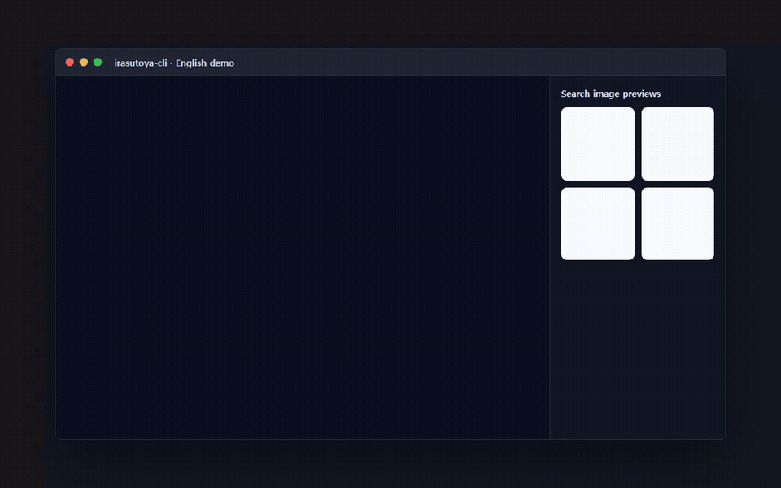

# irasutoya-cli

Languages: **English** | [日本語](./README.ja.md) | [中文](./README.zh.md) | [한국어](./README.ko.md)



## Agent Skill Installation

This repository includes agent skills that run the real `irasutoya` CLI search wrapper. Claude Code project skills live under `.claude/skills/<skill-name>/SKILL.md`, and plugin skills live under `<plugin>/skills/<skill-name>/SKILL.md`; those layouts match the Claude Code skills and plugins documentation.

### Codex Skill

Use the project-local Codex skill from this repository:

```sh
python .codex/skills/irasutoya-search/scripts/irasutoya_search.py cat
```

In Codex, invoke it as `$irasutoya-search` or ask for an Irasutoya illustration search in natural language.

### Claude Project Skill

Start Claude Code from the repository root so it discovers `.claude/skills/irasutoya-search`:

```sh
claude
```

Then invoke:

```text
/irasutoya-search cat
```

### Claude Plugin

Load the local plugin package directly while developing or testing:

```sh
claude --plugin-dir .claude/plugins/irasutoya-search
```

Then invoke the namespaced skill:

```text
/irasutoya-search:irasutoya-search cat
```

After changing plugin files in a running Claude Code session, run `/reload-plugins` or restart Claude Code.

[](https://libraries.io/github/Mineru98/irasutoya-cli)


## Setup

The native Go CLI is the cross-platform distribution target for Windows, macOS, and Linux.

```sh
$ git clone https://github.com/Mineru98/irasutoya-cli.git
$ cd irasutoya-cli
$ go build ./cmd/irasutoya
```

The CI and release baseline is Go 1.26.4. The current `go.mod` remains compatible with the local migration environment's Go 1.24.3 toolchain until the local toolchain is upgraded.

## Usage

```sh
$ irasutoya help
Commands:
  irasutoya random          # Gives you random irasutoya image
  irasutoya search {query}  # Gives you 3 irasutoya images by given query
```

The CLI accepts localized search terms for common ONE PIECE character demos, such as `luffy`, `zoro`, `ルフィ`, `ゾロ`, `路飞`, `索隆`, `루피`, and `조로`.

By default, the Go CLI prints page metadata and image URLs without opening external applications. To open image URLs with the OS default application, opt in explicitly:

```sh
$ irasutoya --open-images random
$ IRASUTOYA_OPEN_IMAGES=1 irasutoya search luffy
```

## Development

```sh
$ go test ./...
$ go build ./cmd/irasutoya
```

Release builds use GoReleaser with `CGO_ENABLED=0` for Windows, macOS, and Linux archives:

```sh
$ goreleaser check
$ goreleaser release --snapshot --clean
```

## Contributing

Bug reports and changes for this fork are handled on GitHub at https://github.com/Mineru98/irasutoya-cli. This project is intended to be a safe, welcoming space for collaboration, and contributors are expected to adhere to the [Contributor Covenant](http://contributor-covenant.org) code of conduct.

## License

This project is available as open source under the terms of the [MIT License](https://opensource.org/licenses/MIT).

## Code of Conduct

Everyone interacting in the irasutoya-cli project’s codebases, issue trackers, chat rooms and mailing lists is expected to follow the [code of conduct](https://github.com/Mineru98/irasutoya-cli/blob/master/CODE_OF_CONDUCT.md).

## Author

Fork maintained by [@Mineru98](https://github.com/Mineru98).

Original project by [@unhappychoice](https://unhappychoice.com).
