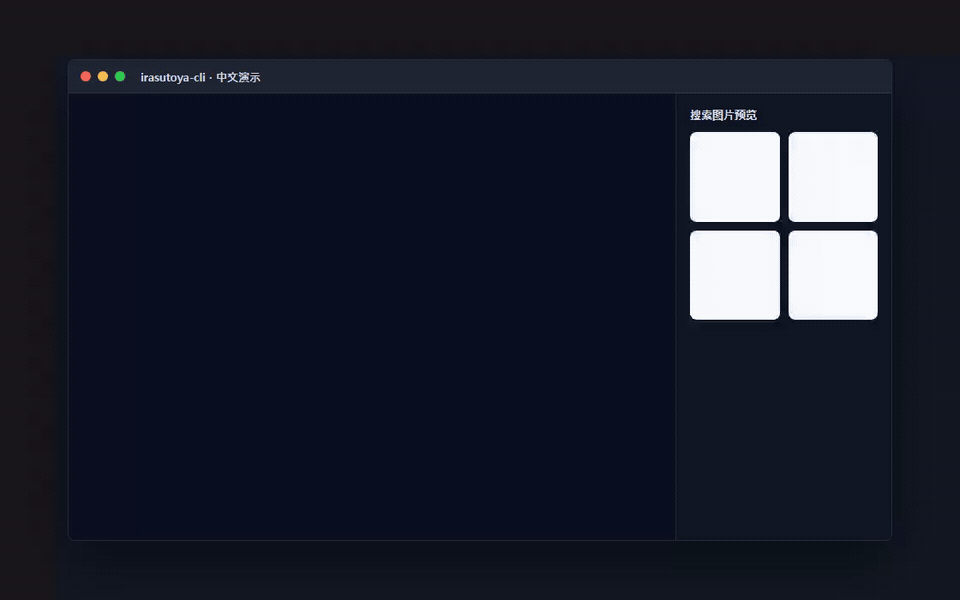

# irasutoya-cli

语言: [English](./README.md) | [日本語](./README.ja.md) | **中文** | [한국어](./README.ko.md)



[](https://libraries.io/github/Mineru98/irasutoya-cli)


## 安装

原生 Go CLI 是面向 Windows、macOS 和 Linux 的跨平台发布目标。

```sh
$ git clone https://github.com/Mineru98/irasutoya-cli.git
$ cd irasutoya-cli
$ go build ./cmd/irasutoya
```

CI 和发布基线是 Go 1.26.4。当前的 `go.mod` 仍兼容本地迁移环境中的 Go 1.24.3 工具链，直到本地工具链升级。

## 使用

```sh
$ irasutoya help
Commands:
  irasutoya random          # 显示一张随机的 irasutoya 图片
  irasutoya search {query}  # 根据搜索词显示 3 张图片
```

CLI 支持常见 ONE PIECE 角色演示用的本地化搜索词，例如 `luffy`、`zoro`、`ルフィ`、`ゾロ`、`路飞`、`索隆`、`루피` 和 `조로`。

默认情况下，Go CLI 只输出页面元数据和图片 URL，不会打开外部应用。若要使用系统默认应用打开图片 URL，请显式启用：

```sh
$ irasutoya --open-images random
$ IRASUTOYA_OPEN_IMAGES=1 irasutoya search 路飞
```

## 开发

```sh
$ go test ./...
$ go build ./cmd/irasutoya
```

发布构建使用 GoReleaser，并以 `CGO_ENABLED=0` 生成 Windows、macOS 和 Linux 归档包：

```sh
$ goreleaser check
$ goreleaser release --snapshot --clean
```

## 贡献

此分支的错误报告和变更在 GitHub 上处理：https://github.com/Mineru98/irasutoya-cli。本项目致力于提供安全、友好的协作空间，贡献者应遵守 [Contributor Covenant](http://contributor-covenant.org) 行为准则。

## 许可证

本项目根据 [MIT License](https://opensource.org/licenses/MIT) 作为开源项目提供。

## 行为准则

所有参与 irasutoya-cli 代码库、Issue、聊天室和邮件列表的人都应遵守[行为准则](https://github.com/Mineru98/irasutoya-cli/blob/master/CODE_OF_CONDUCT.md)。

## 作者

分支维护者：[@Mineru98](https://github.com/Mineru98)

原项目作者：[@unhappychoice](https://unhappychoice.com)
